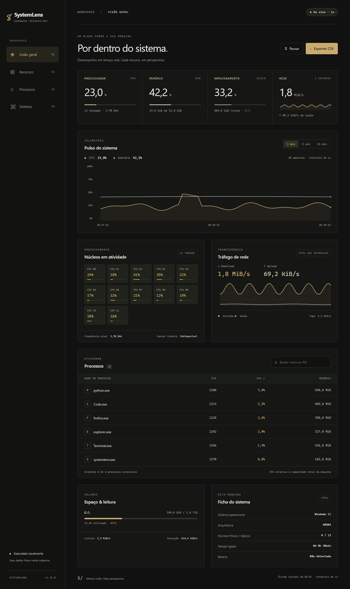

# SystemLens

**Menos ruído. Mais perspectiva.**

Um monitor local de hardware e desempenho em Python. O SystemLens coleta métricas reais do computador e as organiza em uma interface em preto e ouro, com gráficos de evolução, detalhes dos recursos e uma visão dos processos em execução.

Python · Métricas do sistema · Visualização de dados



*Imagem de apresentação com dados ilustrativos. Ao executar, todas as métricas vêm do seu computador.*

## Rodar em dois minutos

Requer **Python 3.10 ou superior**. Funciona em Windows, Linux e macOS, respeitando os recursos e as permissões de cada sistema.

```bash
git clone https://github.com/lRyzc/SystemLens.git
cd SystemLens
python -m venv .venv
```

Ative o ambiente virtual:

```powershell
# Windows PowerShell
.venv\Scripts\Activate.ps1
```

```bash
# Linux / macOS
source .venv/bin/activate
```

Instale e execute:

```bash
python -m pip install .
python -m systemlens
```

O navegador abre em **http://127.0.0.1:8765**. Encerre com `Ctrl+C` no terminal. Se a ativação do PowerShell estiver bloqueada, use `.venv\Scripts\python.exe -m pip install .` e `.venv\Scripts\python.exe -m systemlens` diretamente, sem alterar a política do sistema.

```bash
# Porta alternativa e execução sem abrir o navegador
python -m systemlens --port 9000 --no-browser
```

O comando `systemlens` também fica disponível no ambiente virtual após a instalação. Não precisa de Node.js, build de frontend, conta ou serviços externos. A instalação baixa dependências; o uso é local e funciona offline.

## O que você acompanha

| Recurso | Leituras |
| --- | --- |
| CPU | Uso total, carga por thread lógica e frequência disponível |
| Identidade do hardware (Windows) | Modelo da CPU e GPUs, código e capacidade de cada módulo RAM, velocidade configurada e modelos dos discos físicos |
| Memória | Percentual, capacidade e uso calculado como total menos disponível |
| Armazenamento | Ocupação dos volumes montados e taxas agregadas de leitura e gravação |
| Rede | Entrada e saída agregadas de todas as interfaces, em bytes por segundo |
| Processos | Nome, PID, CPU e memória residente; busca e ordenação |
| Sistema | SO, arquitetura, núcleos físicos/lógicos, tempo ligado e bateria |
| Sensores | Maior temperatura entre sensores disponíveis, quando suportados |

- Atualização a cada segundo, com janelas de **1, 5 ou 15 minutos**.
- Histórico limitado às últimas **900 amostras**, mantido somente em memória.
- Pausa congela a visualização; a coleta e a exportação continuam.
- Busca por nome ou PID e ordenação ascendente/descendente por CPU ou memória. A tabela mostra os primeiros 12 resultados.
- Exportação CSV do histórico completo disponível, com horário UTC, percentuais e taxas em B/s.
- Interface responsiva, navegação por teclado e respeito à preferência por movimento reduzido.

## Como as métricas são calculadas

O `psutil` consulta as APIs do sistema operacional em uma única thread de coleta, compartilhada entre todos os clientes. As taxas de rede e disco usam a diferença dos contadores dividida pelo tempo monotônico efetivamente transcorrido. A primeira leitura de taxas é zero; reinícios de contadores não geram valores negativos.

A CPU dos processos é normalizada pelo número de threads lógicas: 100% significa a capacidade total da máquina. Isso pode diferir de ferramentas que mostram 100% por núcleo. Novos processos precisam de duas leituras para ter uma taxa de CPU. Processos encerrados ou sem permissão de leitura são ignorados.

O histórico começa vazio; os gráficos crescem conforme as leituras chegam, sem preencher o passado com dados inventados. Amostras com mais de cinco segundos sem atualização são sinalizadas como desatualizadas.

## Limites conhecidos

- O modelo dos adaptadores de vídeo é identificado no Windows; uso e temperatura da GPU não são monitorados nesta versão. Adaptadores virtuais também podem aparecer.
- A ficha de hardware usa CIM do Windows uma vez ao iniciar, em segundo plano. A identificação por modelo em Linux/macOS ainda não está implementada. Permissões, BIOS e drivers podem limitar os detalhes disponíveis.
- O código do módulo RAM (part number) é exibido como modelo, sem inferir o nome comercial. A velocidade é a configurada em MT/s, não necessariamente a nominal do kit. Discos físicos e volumes montados são apresentados separadamente.
- Temperaturas normalmente não são expostas pelo `psutil` no Windows ou macOS. A interface mostra “Indisponível”; não estima valores. O sensor térmico representa o maior sensor reportado, não necessariamente a CPU.
- Frequência, bateria e contadores de I/O dependem do SO e do hardware.
- Rede agrega interfaces, inclusive virtuais/loopback. Não mede velocidade contratada da internet.
- Memória dos processos é RSS; páginas compartilhadas podem aparecer em mais de um processo.
- O uso de disco no cartão inicial corresponde ao primeiro volume acessível; os demais aparecem em “Volumes”.
- Reiniciar o app apaga o histórico. Não há banco de dados nem coleta permanente.
- O servidor foi feito para uso local, não para hospedagem pública. Publicar o código no GitHub não transmite as métricas do computador.

## Estrutura

```text
systemlens/
  __main__.py       CLI e ciclo de vida
  collector.py      Coleta, taxas e histórico
  hardware.py       Identificação de componentes via CIM do Windows
  server.py         API local, arquivos estáticos e exportação
  static/
    index.html     Interface sem framework
    style.css      Tema preto e ouro, layout responsivo
    app.js         Gráficos SVG e interação
tests/             Testes de coleta, exportação e HTTP
```

O frontend usa JavaScript nativo e SVG. Os nomes de processos e os caminhos são inseridos como texto, sem interpretar HTML. O servidor aceita somente loopback, valida Host/Origin e não permite leitura por outras origens. Não coleta comandos, variáveis de ambiente, nome de usuário ou hostname. Não há telemetria, fontes remotas ou CDN.

## Desenvolvimento e testes

```bash
python -m pip install -e .
python -m unittest discover -s tests -v
```

O workflow do GitHub Actions executa os testes em Windows, Linux e macOS com Python 3.10 e 3.13. Os testes verificam deltas, reinício de contadores, sensores ausentes, amostras reais, limite de histórico, exportação, arquivos estáticos e isolamento de origem.

## Licença

[MIT](LICENSE).
